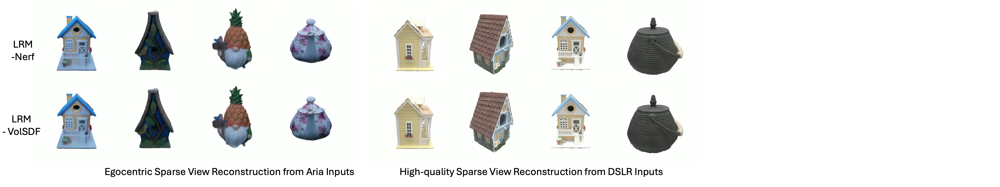
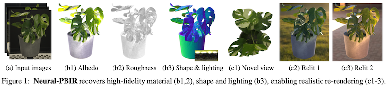
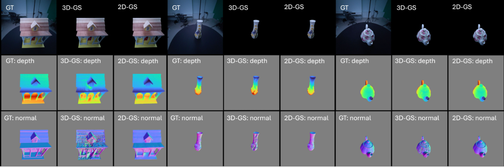

# Digital Twin Catalog (DTC) Dataset and 3D Reconstruction Baseline Methods
[[Project Page]](https://www.projectaria.com/datasets/dtc/) [[Data Explorer]](https://dtc.projectaria.com/) [[Paper]](https://arxiv.org/abs/2504.08541) [[Bibtex]](https://github.com/facebookresearch/DigitalTwinCatalog/blob/add_readme/README.md#attribution)

Digital Twin Catalog (DTC) is a new large-scale photorealistic 3D object digital twin dataset. It features 2,000 scanned digital twin-quality 3D objects, along with image sequences captured under different lighting conditions using DSLR cameras and egocentric AR glasses. This dataset establishes the first comprehensive real-world evaluation benchmark for 3D digital twin creation tasks, offering a robust foundation for comparing and improving existing reconstruction methods. This repository includes 3D reconstrution tools and baselines used in the dataset creation and evaluation process, including egocentric 3D Gaussian reconstruction, feed-forward sparse view reconstruction and optimization-based neural inverse rendering.

## Feed-forward Sparse View Reconstruction
We implemented [Large Reconstruction Model](https://yiconghong.me/LRM/) (LRM) as one of our baselines for feedforward sparse-view reconstruction. Our implementation resembles [MeshLRM](https://sarahweiii.github.io/meshlrm/). We provide 2 variations of LRM, LRM-NeRF and LRM-VolSDF, which reconstruct 3D objects in the form of neural radiance fields and sign distance fields respectively.



If you use our implementation, please also attribute this following work from which this implementation is created as a baseline.
```
@inproceedings{li2025lirm,
  title={LIRM: Large Inverse Rendering Model for Progressive Reconstruction of Shape, Materials and View-dependent Radiance Fields},
  author={Zhengqin Li and Dilin Wang and Ka Chen and Zhaoyang Lv and Thu Nguyen-Phuoc and Milim Lee and Jia-bin Huang
    and Lei Xiao and Cheng Zhang and Yufeng Zhu and Carl S. Marshall and Yufeng Ren and Richard Newcombe and Zhao Dong},
  journal={Proceedings of the IEEE/CVF Conference on Computer Vision and Pattern Recognition (CVPR)},
  year={2025},
}
```

## Optimization-based Neural Inverse Rendering (neural_pbir)
Neural-PBIR combines neural-based object reconstruction and physics-based inverse rendering (PBIR). Specifically, the pipeline firstly leverages a neural stage to produce high-quality but potentially imperfect predictions of object shape, reflectance, and illumination. Then, in the later stage, initialized by the neural predictions, PBIR is performed to refine the initial results and obtain the final high-quality reconstruction.



This is the source code for our ICCV 2023 submission: *Neural-PBIR Reconstruction of Shape, Material, and Illumination* [[Project Page]](https://neural-pbir.github.io/). When using the tool, please attribute it as follows:
```
@inproceedings{neuralpbir2023,
  author       = {Cheng Sun and
                  Guangyan Cai and
                  Zhengqin Li and
                  Kai Yan and
                  Cheng Zhang and
                  Carl Marshall and
                  Jia{-}Bin Huang and
                  Shuang Zhao and
                  Zhao Dong},
  title        = {Neural-PBIR Reconstruction of Shape, Material, and Illumination},
  booktitle    = {{ICCV} 2023},
  year         = {2023},
}
```

## Egocentric Reconstruction using Gaussian Splatting

For all the egocentric reconstructions in the DTC dataset, we use the 3D Gaussian Splatting and 2D Guassian Splatting as the scene representation implemented in the work "Photoreal Scene Rconstruction from an Egocentric Device", which you can find in the "egocentric_splats" by

```
git submodule update --init --recursive egocentric_splats
```

The implementation utilizes the visual inertial closed loop trajectory provided by the egocentric device and considers the physical image formation model in the neural reconstruction. Both are important to achieve the photoreal synthesis and geometric recosntruction for the DTC object.



If you use this implementation, please attribute it as follows
```
@inproceedings{lv2025egosplats,
  title={Photoreal Scene Reconstruction from an Egocentric Device},
  author={Lv, Zhaoyang and Monge, Maurizio and Chen, Ka and Zhu, Yufeng and Goesele, Michael and Engel, Jakob and Dong, Zhao and Newcombe, Richard},
  booktitle={ACM SIGGRAPH}
  year={2025}
}
```

## License
DTC dataset and code are released by Meta under the Creative Commons Attribution-NonCommercial 4.0 International License ([CC BY-NC 4.0](https://creativecommons.org/licenses/by-nc/4.0/deed.en)). Data and code may not be used for commercial purposes. For more information, please refer to the LICENSE file included in each repository.

## Attribution
When using the dataset, please attribute it as follows:
```
@inproceedings{Dong_2025_CVPR,
  author			= {Dong, Zhao and Chen, Ka and Lv, Zhaoyang and Yu, Hong-Xing and Zhang, Yunzhi and Zhang, Cheng and Zhu, Yufeng and Tian, Stephen and Li, Zhengqin and Moffatt, Geordie and Christofferson, Sean and Fort, James and Pan, Xiaqing and Yan, Mingfei and Wu, Jiajun and Ren, Carl Yuheng and Newcombe, Richard},
  title				= {Digital Twin Catalog: A Large-Scale Photorealistic 3D Object Digital Twin Dataset},
  booktitle 	= {Proceedings of the IEEE/CVF Conference on Computer Vision and Pattern Recognition (CVPR)},
  month				= {June},
  year				= {2025}
}
```
When using our code, please refer to each directory and attribute it accordingly.

## Contribute
We welcome contributions! Go to [CONTRIBUTING](https://github.com/facebookresearch/DigitalTwinCatalog/blob/add_readme/.github/CODE_OF_CONDUCT.md) and our [CODE OF CONDUCT](https://github.com/facebookresearch/DigitalTwinCatalog/blob/main/.github/CONTRIBUTING.md) for how to contribute.
