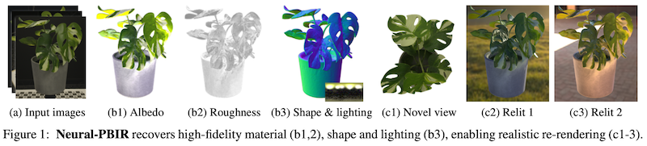

# neural-pbir

### [Neural-PBIR Reconstruction of Shape, Material, and Illumination](https://neural-pbir.github.io) <br>
 [Cheng Sun](https://sunset1995.github.io/)<sup>1, 2</sup>\*,
 [Guangyan Cai](https://guangyancai.me/)<sup>1, 3</sup>\*,
 [Zhengqin Li](https://sites.google.com/a/eng.ucsd.edu/zhengqinli)<sup>1</sup>,
 [Kai Yan](https://yank.ai/)<sup>3</sup>,
 [Cheng Zhang](https://holmes969.github.io/)<sup>1</sup>,
 [Carl Marshall](https://www.linkedin.com/in/carl-s-marshall)<sup>1</sup>,
 [Jia-Bin Huang](https://jbhuang0604.github.io/)<sup>1, 4</sup>,
 [Shuang Zhao](https://www.shuangz.com/)<sup>3</sup>,
 [Zhao Dong](http://flycooler.com/)<sup>1</sup> <br>
 <sup>1</sup>Meta RLR, <sup>2</sup>National Tsing Hua University, <sup>3</sup>University of California, Irvine, <sup>4</sup>University of Maryland, College Park <br>
  \*Indicates Equal Contribution  
in ICCV 2023 (Poster)

A robust object reconstruction pipeline combining neural based object reconstruction and physics-based inverse rendering (PBIR).
### [project page](https://neural-pbir.github.io) | [paper](https://arxiv.org/abs/2304.13445)



## Install dependency
Run the following to create and activate conda environment `neural-pbir`:
```bash
conda env create -v -f environment.yml
conda activate neural-pbir
pip install torch==2.4.0 torchvision==0.19.0 torchaudio==2.4.0 --index-url https://download.pytorch.org/whl/cu124   # Install Pytorch (tested with 2.4.0+cu124)
pip install -r requirements.txt
```
Since we rely on Blender for uv unwrapping and rerendering, please follow the [installation guide](https://docs.blender.org/manual/en/latest/getting_started/installing/index.html) to install it. Make sure its version >= 2.8 and it is included in `PATH` because we will call it in terminal. On Debian or Ubuntu, you can do
```bash
sudo apt-get install blender -y
```

## Datasets
Please find [README_DATA](README_DATA.md) for more guide to prepare your dataset or pre-process other datasets.

## Running
### Stage1: neural surface reconstruction
Reconstruct mesh and radiance field from a set of calibrated images.
```bash
python neural_surface_recon/run_template.py \
        --template {template_config.py} \
        --savemem \
        {path_to_dataroot}
```
- `--template str`: path to template config file. See `neural_surface_recon/configs/` for some examples.
- `--scale_lap float`: scale laplacian regularization weight. Larger smoother.
- `--scale_photoloss float`: scale photometric loss weight. Larger sharper.
- `--savemem`: do not load all data into gpu to save memory.
- `--scale_grid float`: scale grid resolution.
- `--scale_iter float`: scale number of training iterations.
- `--scale_bs float`: scale number of rays in a training batch.
- `--test_only`: do not run training. Only load trained model to test.

See `scripts/examples/stage1_neural_surface_recon.sh` for an concrete example.

Hereby after, all results will be dumped into `results/{dataset_type}/{dataroot_name}/` which is abbreviated as `{ckptroot}`.
The results of this stage will be saved to `{ckptroot}/neural_surface_recon`.
Some important results are:
- `mesh.obj`: the reconstructed mesh which is already remeshed and uv-unwrapped.
- `args.txt`, `config.py`: the configuration of this run.
- `fine_last.pth`: the pytorch checkpoint.
- `bg360.png`: visualization of the 360 background from object center.
- `progression_normal/`: the intermediate surface visualization during training.

### Stage2: neural distillation
Distill the radiance field into a more constraint material map and environment lighting representation.
```bash
python neural_distillation/run.py {ckptroot}
```
- `--n_lobe`: number of sg lobes for environment lighting.
- `--n_samp`: number of incident light samples (on a sphere so half of them will be invalid for each position).
- `--F0 float`: F0 fresnel reflectance.
- `--use_metal`: use metallic map.
- `--n_iter int`: number of optimization iterations.
- `--step_every int`: accumulate the gradient before an optimization step.
- `--split_size int`: split the rendering positions in a batch into smaller chunk to save mem.
- `--lr_warmup_iters`: number of lr linear warmup iteration.
- `--lr_albedo`, `--lr_rough`, `--lr_metal`, `--lr_lgt`: lr of the material and lighting parameters.
- `--w_envobs`: regularization strength for the lighting.

See `scripts/examples/stage2_neural_distillation.sh` for an concrete example.

The results of this stage will be saved to `{ckptroot}/neural_distillation/`.
Some important results are:
- `albedo.exr`: the albedo map.
- `roughness.exr`: the roughness map.
- `mask.png`: indicate the valid pixels on the maps.
- `envmap.exr`: the environment lighting.

### Stage3: physics-based inverse rendering (PBIR)
Further refine the shape, material, and illumination using physics-based inverse rendering with a differentiable pathtracer.
```bash
python pbir/run.py {configroot} {ckptroot}
```
`configroot` is a directory containing the config files for the pbir stage and `ckptroot` is the same checkpoint directory as stage 1 and stage 2. See `scripts/example/stage3_pbir.sh` for an concrete example on running experiments and see `pbir/README.md` for a more detailed description of the config files.

The results of this stage will be saved to `{ckptroot}/pbir/`.
Some important results are:
- `diffuse.exr`: the albedo map.
- `roughness.exr`: the roughness map.
- `envmap.exr`: the environment lighting.
- `mesh.obj`: the mesh.

## Re-lighting using blender
We provide blender headless rendering script to render material and relighted views from the given poses.
```bash
RELIT_GEO=results/charuco/dinosaur/pbir/mesh.obj
RELIT_ALBEDO=results/charuco/dinosaur/pbir/diffuse.exr
RELIT_ROUGH=results/charuco/dinosaur/pbir/roughness.exr
RELIT_CAM=data/neural_pbir_real/dinosaur/cameras.json

python scripts/relit/relit.py $RELIT_GEO $RELIT_ALBEDO $RELIT_ROUGH $RELIT_CAM \
        --lgt_paths envmap_mii/*exr envmap_blender/*exr
```
All results will be saved into a `blender_relit/`, which is under the same folder as the albedo `$RELIT_ALBEDO` (for above example, it is `results/charuco/dinosaur/pbir/blender_relit/`). The results are:
- `im_{xxxx}_[roughness|albedo]0029.exr`. The `xxxx` is the index to the given camera poses. It only render the test split by default.
- `im_{xxxx}_{lgt_name}.png`. You can provide some glob paths to the environment lighting to render the religting views. Some envmaps can be downloaded from [blender github](https://github.com/blender/blender/tree/main/release/datafiles/studiolights/world) and [MII github](https://github.com/zju3dv/InvRender/tree/main/code/envmaps).

## Citation
```
@inproceedings{neuralpbir2023,
  author       = {Cheng Sun and
                  Guangyan Cai and
                  Zhengqin Li and
                  Kai Yan and
                  Cheng Zhang and
                  Carl Marshall and
                  Jia{-}Bin Huang and
                  Shuang Zhao and
                  Zhao Dong},
  title        = {Neural-PBIR Reconstruction of Shape, Material, and Illumination},
  booktitle    = {{ICCV} 2023},
  year         = {2023},
}
```
